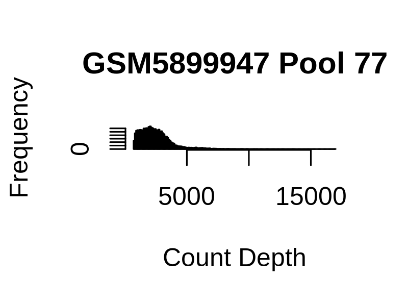
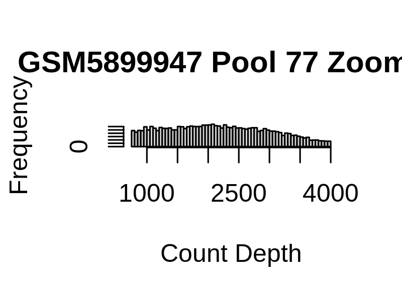
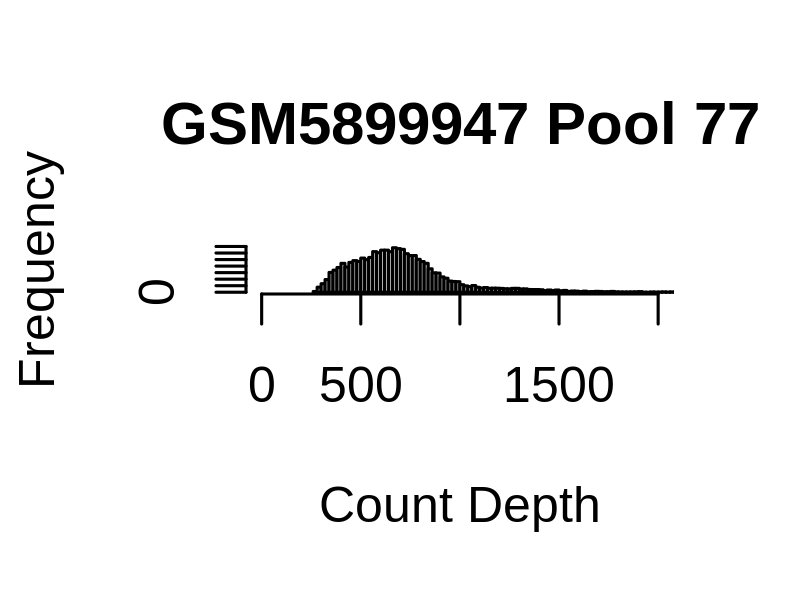

```{r setup, include=FALSE}
knitr::opts_chunk$set(echo=FALSE)
```

```{css style settings, echo = FALSE}
blockquote {
    padding: 10px 20px;
    margin: 0 0 20px;
    font-size: 14px;
    border-left: 5px solid #eee;
}
```

## Week of July 17

This week, I am running some exploratory analyses on the OneK1K data. I didn't have time to make plots from all files so we are just using /project2/xuanyao/manuela/OneK1K_data/GSM5899947_OneK1K_Pool77_RawCounts.csv.gz for the following plots.

{width=40%}

{width=40%}

{width=40%}

## Week of July 25

Redid the plots from last week but with all of the data:

{width=40%}

{width=40%}

Learned to include images into workflowr. The image needs to be in docs/assets, then run the wflow_git_commit command on the image, publish the rmd file and push the repo.

Starting some processing of the data with Seurat. I'm following this tutorial: https://satijalab.org/seurat/articles/pbmc3k_tutorial.html. 

The first plot shows that there are no mitochondrial genes in the dataset. It looks like they might have been filtered out. We can also see that there are some outliers. Maybe check with Xuanyao but for now I'll filter cells with more than 2000 genes. Leaning towards using 1500 as a threshold. I'm also going to filter cells with over 10000 reads for now. 

{width=60%}

The second plot generated in the tutorial. Tbh I'm not sure what the take home message is here.

{width=60%}

I normalized the data using default parameters
```{r, eval=FALSE}
pbmc <- NormalizeData(pbmc, normalization.method = "LogNormalize", scale.factor = 10000)
```

I then selected the 10,000 most variable genes. The tutorial used 2000 but paper said 5k to 10k and I'm starting out with the most lenient thresholds possible. I also don't understand this plot. 

{width=60%}

Scaled data so mean is 0 variance is 1.

PCA results:

{width=60%}

{width=60%}

To do: Figure out why the names are numbers and not the actual names we had earlier.

## Week of July 31

Continuing the PCA plots:

{width=60%}

{width=60%}
{width=60%}


Then, we make the jack straw plot. You can kind of read these like a qqplot: significant PCs are the ones that look inflated. This should tell you how many PCs you need to have a meaningful compression of the dataset. From this plot, it looks like all 20 (max number I can plot) are relevant.

{width=60%}

The same conclusion can be drawn from the elbow plot. It does however seem like the values are starting to converge.

{width=60%}